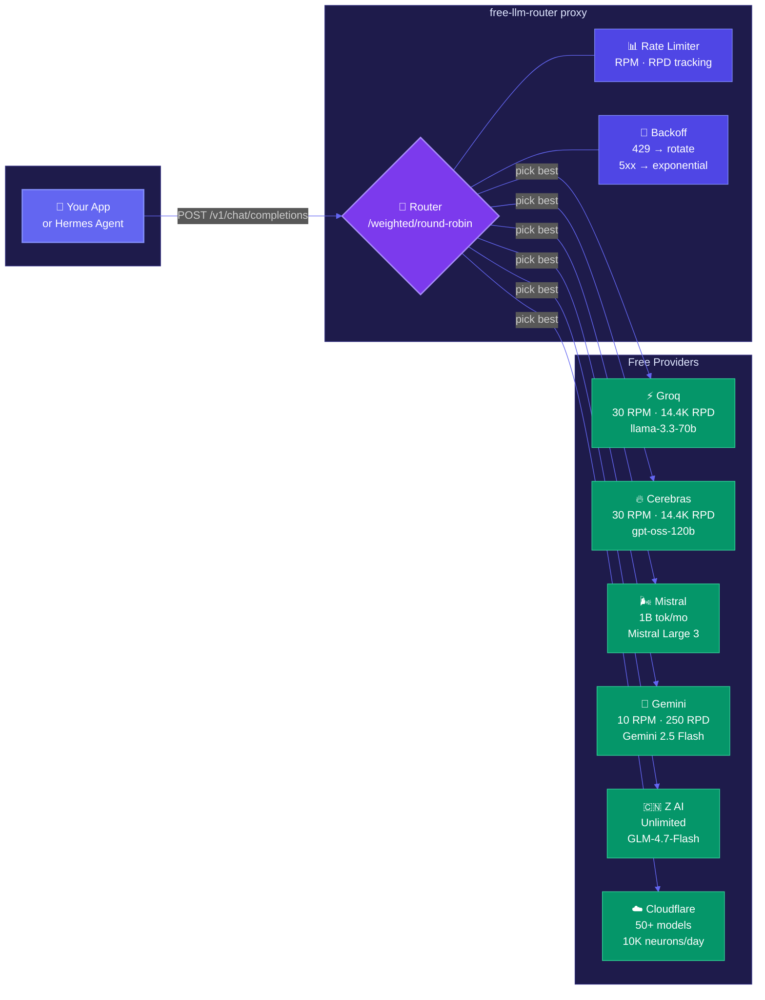
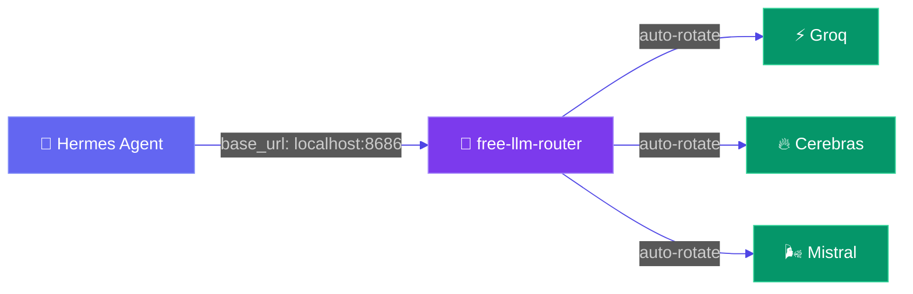
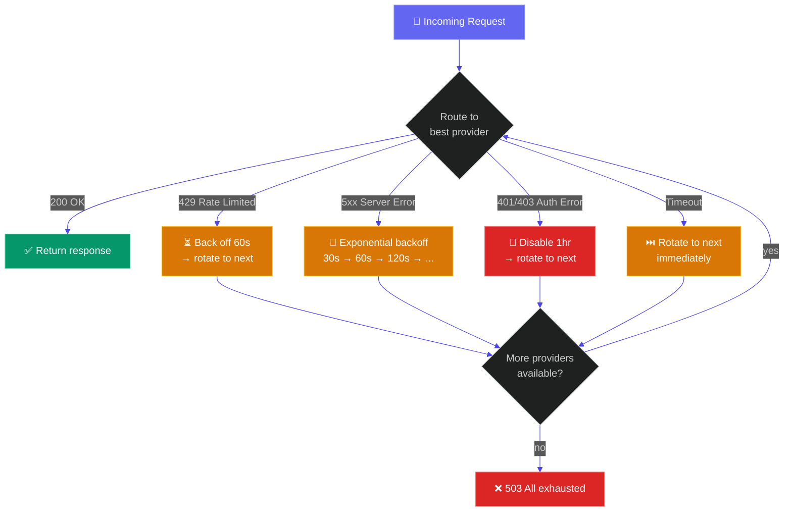

<div align="center">
  <br>
  
  <br>
  <br>

  <p><strong>Combine every free LLM API tier into one endpoint.</strong></p>
  <p>A rotator proxy that gives you 30K+ free requests per day.</p>

  <br>

  [](https://python.org)
  [](https://fastapi.tiangolo.com)
  [](LICENSE)

  <br>
  <br>
</div>

---

## How it works



**One endpoint. OpenAI-compatible. Automatic rotation.**

---

## Free budget

| Provider | RPM | Requests/day | Speed | Models |
|----------|-----|-------------|-------|--------|
| ⚡ **Groq** | 30 | 14,400 | ~2,600 tok/s | llama-3.3-70b, qwen3-32b, deepseek-r1 |
| 🔥 **Cerebras** | 30 | 14,400 | ~2,600 tok/s | gpt-oss-120b, qwen-3-235b, llama3.1-8b |
| 🌬️ **Mistral** | ~1 RPS | ~1B tokens/mo | normal | Mistral Large 3, Codestral, Pixtral |
| 💎 **Gemini** | 10–15 | 250–1,000 | fast | Gemini 2.5 Flash, Flash-Lite |
| 🇨🇳 **Z AI** | 1 concurrent | unlimited | normal | GLM-4.7-Flash, GLM-4.5-Flash |
| ☁️ **Cloudflare** | shared | 10K neurons | normal | 50+ models (Llama, Mistral, Qwen, DeepSeek) |
| 🐙 **GitHub Models** | 10–15 | 50–150 | normal | GPT-4.1, o4-mini, DeepSeek-R1 |

**Combined: ~30,000+ requests/day for $0.**

No credit cards. No trials. Permanent free tiers.

---

## Quick start

```bash
# clone
git clone https://github.com/DevvGwardo/free-llm-router.git
cd free-llm-router

# install
pip install -r requirements.txt

# configure — just set your API keys
export GROQ_API_KEY="gsk_..."
# export CEREBRAS_API_KEY="..."    # add more = more free budget
# export MISTRAL_API_KEY="..."

# run
python run.py
```

**Test it:**

```bash
curl -X POST http://localhost:8686/v1/chat/completions \
  -H "Content-Type: application/json" \
  -d '{
    "model": "llama-3.3-70b-versatile",
    "messages": [{"role": "user", "content": "hello"}]
  }'
```

---

## Hermes integration

Point [Hermes Agent](https://github.com/NousResearch/hermes-agent) at the router:

```bash
hermes config set model.base_url http://localhost:8686/v1
hermes config set model.api_key not-needed
```

Hermes thinks it's talking to one endpoint.
The router secretly rotates across all your free providers.



---

## Rotation strategies

Set in `config.yaml`:

```yaml
strategy: weighted  # default
```

| Strategy | Behavior | Best for |
|----------|----------|----------|
| **`weighted`** | Picks provider with most remaining capacity | Maximize throughput |
| **`round_robin`** | Cycles evenly through all providers | Even usage |
| **`fallback`** | Uses highest-priority provider until exhausted | Simplicity |

---

## Error handling

The router handles provider failures automatically:



---

## Status dashboard

```bash
curl http://localhost:8686/status | jq
```

```json
{
  "strategy": "weighted",
  "total_available": 2,
  "total_providers": 2,
  "providers": [
    {
      "name": "groq",
      "quota": {
        "rpm_remaining": 29,
        "rpd_remaining": 14399,
        "score": 0.983,
        "is_available": true
      }
    }
  ]
}
```

---

## Configuration

```yaml
# config.yaml

strategy: weighted       # round_robin | weighted | fallback
max_retries: 3           # attempts before giving up
# data_path: data.json   # optional: auto-detect models from awesome-free-llm-apis

providers:
  groq:
    enabled: true
    base_url: https://api.groq.com/openai/v1
    api_key: ${GROQ_API_KEY}

  cerebras:
    enabled: true
    base_url: https://api.cerebras.ai/v1
    api_key: ${CEREBRAS_API_KEY}

  mistral:
    enabled: true
    base_url: https://api.mistral.ai/v1
    api_key: ${MISTRAL_API_KEY}
```

**Every provider supports `${ENV_VAR}` syntax** — no keys in config files.

---

## API

The proxy exposes an OpenAI-compatible interface:

| Endpoint | Method | Description |
|----------|--------|-------------|
| `/v1/chat/completions` | POST | Chat completions (streaming supported) |
| `/v1/models` | GET | List all available models |
| `/status` | GET | Provider usage & quota dashboard |
| `/health` | GET | Health check |

---

## Get free API keys

All of these are **free, no credit card required**:

| Provider | Sign up | Time |
|----------|---------|------|
| ⚡ Groq | [console.groq.com](https://console.groq.com/keys) | Instant |
| 🔥 Cerebras | [cloud.cerebras.ai](https://cloud.cerebras.ai/) | Instant |
| 🌬️ Mistral | [console.mistral.ai](https://console.mistral.ai/api-keys) | Instant |
| 💎 Gemini | [aistudio.google.com](https://aistudio.google.com/app/apikey) | Instant |
| ☁️ Cloudflare | [dash.cloudflare.com](https://dash.cloudflare.com/profile/api-tokens) | Instant |

---

## Project structure

```
free-llm-router/
├── free_llm_router/
│   ├── router.py          # FastAPI app — the proxy
│   ├── providers.py       # Provider abstraction & API adaptation
│   ├── rate_limiter.py    # Per-provider RPM/RPD tracking
│   └── config.py          # Config loading & env var resolution
├── config.yaml            # Provider configuration
├── run.py                 # Entry point
├── sync_data.py           # Pull latest model data
└── requirements.txt
```

---

## Data source

Model data synced from [awesome-free-llm-apis](https://github.com/mnfst/awesome-free-llm-apis) — the definitive list of permanent free LLM API tiers.

```bash
python sync_data.py  # pulls latest data.json
```

---

<div align="center">
  <p>Built with 🏴‍☠️ by <a href="https://github.com/DevvGwardo">DevvGwardo</a></p>
  <p>
    <a href="https://github.com/mnfst/awesome-free-llm-apis">awesome-free-llm-apis</a> ·
    <a href="https://github.com/NousResearch/hermes-agent">Hermes Agent</a>
  </p>
</div>
